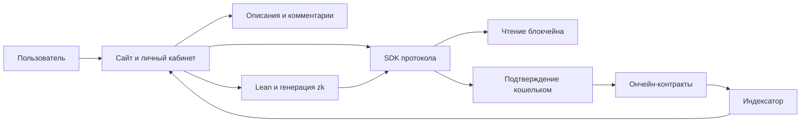
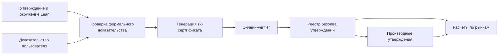
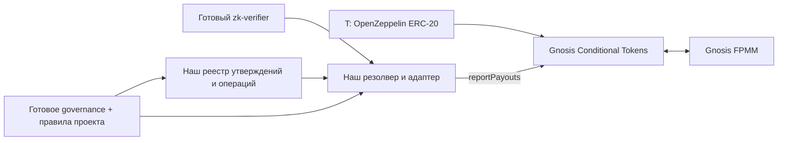

# Архитектура и слои

Статус: ончейн-AMM, Lean, zk-резолв и расширяемый governance заданы пользователем. Разделение на ончейн-протокол и офчейн-SDK/сайт/личный кабинет принято. Детальные слои ниже — предложение ассистента. Сеть, стек, AMM и zk-backend не выбраны.

Актуальная рекомендация: [три сборки A/B/C](./architecture-options.md), с приоритетом B для максимального переиспользования. Этот документ описывает общие логические слои; [integration blueprint](./integration-blueprint.md) конкретизирует их на готовых компонентах. Для Lean предложены и исследованы NanoDa + стандартная zkVM, Ix и специализированный резерв; сквозной benchmark остаётся первым шагом.

Принят принцип максимального использования готовых open source-решений. Слои описывают ответственность, а не обязательство написать собственные реализации. Композиция-кандидат — OpenZeppelin T + Gnosis Conditional Tokens + готовый AMM + адаптер доказательного резолва. AMM сравниваем по модели LP и встроенному доходу протокола: FPMM, LMSR, Uniswap V2, Balancer V3; см. [готовые компоненты](./components.md).

## Что фиксируем при проектировании

- Контекст системы и её внешние зависимости.
- Состав слоёв и компонентов, их назначение и границы ответственности.
- Разрешённые направления зависимостей и взаимодействий.
- Владение данными, состоянием и бизнес-правилами.
- Прохождение ключевых пользовательских сценариев через систему.
- Границы процессов и развёртывания, когда они станут известны.
- Поведение при ошибках и существенные требования к эксплуатации.

Логические слои не подразумевают отдельные сервисы или процессы. Их размещение определим отдельно, исходя из требований.

## Принятое разделение протокола и приложения

Ончейн-часть хранит обязательное состояние и исполняет правила. Офчейн-приложение обеспечивает просмотр, обсуждение, работу с Lean и удобное выполнение действий кошельком. Личный кабинет — представление активности адреса, а не отдельное хранилище его средств.

Способы хранения, индексатор и runner — предложения реализации этой границы. Полный разбор: [офчейн-приложение](./offchain-application.md).

## Описание каждого согласованного слоя

Для каждого слоя указываем ответственность, входы и выходы, допустимые зависимости, принадлежащие ему данные, ограничения и ссылки на контракты. При необходимости добавляем схему и пример потока данных.

## Предлагаемые границы

| Слой | Ответственность и принадлежащее ему состояние | Основные зависимости |
| --- | --- | --- |
| Язык утверждений | Описания Lean-утверждений, выражения над ними, идентификаторы и версии семантики | Реестры окружений и операций |
| Проверка доказательств | Проверка zk-сертификата и его связи с конкретной формальной целью | Реестр verifier и профилей проверки |
| Резолв | Состояние утверждения, принятый исход, время и основание перехода | Язык, проверка доказательств, обработчики операций |
| Токены и расчёты | Выпуск, обеспечение, погашение и права владельцев токенов | T и зафиксированный исход резолва; экономика ещё не определена |
| Рынки и AMM | Пулы, резервы, обмены, позиции ликвидности, торговые комиссии | Токены, параметры AMM, состояние рынка |
| Комиссии и выгодополучатели | Доли, согласия на изменение, учёт и получение комиссий | Поступления комиссий и версия распределения |
| Governance и реестры | Принятие/исполнение изменений, доступные версии Lean, verifier и операций | Механизм голосования пока не определён |
| Пользовательские инструменты | Подготовка Lean, генерация сертификатов, создание и отправка транзакций, отображение состояния | Публичные контракты и доступные исходные данные |

Это логические границы, а не список отдельных контрактов для обязательного развёртывания. Governance влияет на настройки нескольких слоёв; точные полномочия и пределы влияния ещё предстоит согласовать.

## Предлагаемый поток резолва

C и Z относятся к вычислительной части приложения; место выполнения ещё не выбрано. Сеть проверяет сертификат и связанные публичные данные. Возможность и стоимость конкретной реализации Lean в zk ещё не проверены.

Кандидаты готовых частей C — Comparator, lean4export, независимый checker NanoDa и исследовательский стек Ix. Comparator снаружи zk — предварительная проверка; гостевая программа обязана независимо устанавливать все существенные свойства цели и решения. Palomar подключается на уровне материалов и метаданных, без права назначать payout. См. [исследование proof paths](./research/proofs.md) и [интеграцию Palomar](./palomar-integration.md).

## Предложение: различать утверждение и рынок

`Statement` задаёт формальную цель и правила резолва. `Market` задаёт торговлю связанными токенами, ликвидность и комиссии. Тогда одна математическая проверка может служить основанием для нескольких рынков и производных выражений.

Альтернатива — один рынок на одно утверждение со встроенным резолвом: меньше сущностей, но теснее связаны логика и торговля. Пользователь пока описывает рынок и утверждение как одну сущность; разделение требует обсуждения.

## Предлагаемые ограничения зависимостей

- AMM использует результат резолва, но цены и объём торгов не являются основанием математического исхода.
- Verifier проверяет предъявленное свидетельство и контекст; запись исхода принадлежит слою резолва.
- Обработчик производного выражения опирается на аутентичное состояние протокола и явно заданное правило времени.
- Реестр выгодополучателей не определяет истинность утверждений.
- Для сложных производных выражений нужны ограничения глубины, затрат вычисления и циклических зависимостей. Конкретный механизм ещё не выбран.

Подробности: [утверждения](./statements-and-resolution.md), [доказательства](./proof-system.md), [контракты](./contracts.md), [governance](./governance.md).

## Предлагаемое размещение на готовых компонентах

Схема выше иллюстрирует вариант с FPMM, а не окончательный выбор. Для альтернатив с готовым доходом протокола предлагается путь `AMM → получатель комиссий → модуль выгодополучателей`. Формы дохода и способы получения уже найдены, конкретный вариант ещё не выбран; см. [сравнение](./amm-and-protocol-fees.md).
