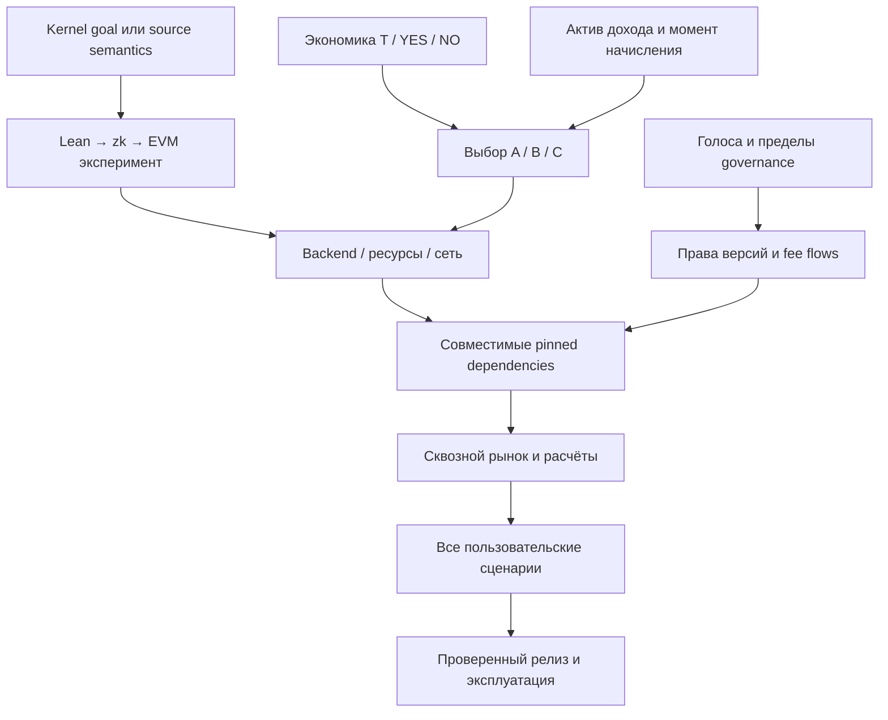

# План проверки и реализации после выбора архитектуры

Статус: рекомендуемая последовательность. Текущая задача пользователя — закончить документацию и исследование; описанные здесь implementation/spike ещё не выполнены. Ни время разработки, ни бюджет proving не выдаём за измеренные величины.

## Что проверено при подготовке документации

- Изучены первичные документация и исходники CTF, AMM/fee mechanisms, wrappers/Seer, proof tooling, governance, Splits и application stack. Ссылки, ограничения и лицензии сохранены в [исследованиях](./research/markets.md), [proofs](./research/proofs.md), [app/governance](./research/app-governance.md).
- Для Lean-компонентов зафиксированы конкретные snapshots исследования; это не совместимый production lockfile. Для многих AMM и frontend-кандидатов пока исследована текущая ветка/документация, конкретный deployment ещё не закреплён.
- Сделана локальная арифметическая проверка terminal arbitrage FPMM: инвариант может сохраняться, хотя после резолва полезные резервы уходят в обмен на проигравший токен. Это иллюстрация без Solidity исполнения, gas и комиссий.
- Выполнена взаимная проверка трёх исследований и общей сборки: source/goal binding, CTF prepare/report, metadata wrapper, epoch/fee boundary и права Split owner уточнены в спецификации.
- Проверена структура 23 Markdown-файлов: локальные ссылки и anchors, таблицы и code fences, уникальные US-001–US-020, их 20 строк покрытия и C-001–C-014. Ошибок этой проверки не обнаружено; она не проверяет поведение будущих контрактов.
- Сквозная генерация zk, Solidity integration tests, сетевой deployment и аудит нашей сборки **не выполнялись**. Открытые критерии ниже не означают успешный результат.

## Порядок зависимостей

## Этап 0. Короткое решение по продуктовым развилкам

Выбираем пять вещей из [сводки](./architecture-options.md): полные наборы и роль T; приоритет AMM; активы и момент комиссий; electorate/границу governance; авторитетную формальную цель. Инженерные defaults — прямые onchain согласия, Split epochs, типизированные derived-операторы, Ponder/viem — можно принять пакетом. Число токенов, адреса первоначального распределения, fee rates и параметры голосования нужны к развёртыванию, а не для чтения исследования.

Результат: отдельная запись решения с выбранным вариантом и отклонёнными альтернативами. Рекомендация ассистента не превращается молча в принятые пользователем права или экономику.

## Этап 1. Проверить наиболее рискованную связку Lean → zk → EVM

Подробный план есть в [proof research](./research/proofs.md). Первым проверяем NanoDa в стандартном RISC Zero; при существенной несовместимости target — тот же подход на SP1. Ix сравниваем ограниченным экспериментом на тех же fixtures, не переносим весь продукт на pre-alpha заранее.

Минимальный проверочный набор: тривиальный True-пример, ложная цель с доказуемым отрицанием, теорема с типичными Mathlib-зависимостями, внешний Challenge/Solution snapshot подходящей версии. Проверяем регистрацию `P : Prop` отдельно от решения. Достаточно малых примеров для проверки цепочки, но недостаточно для обещания работы произвольного Mathlib.

Обязательный положительный результат — реальный финальный EVM-совместимый сертификат, принятый локальным Solidity verifier и привязанный к нужным goal/environment/profile/kind. Не считаем успехом host-лог «Lean passed», zkVM execution-only режим, незакрытые assumptions, небезопасно отключённую проверку ключей или proof другого формата.

Отрицательные случаи: подмена P/типа/зависимости, стандартной аксиомы под допустимым именем, `sorryAx`, недопустимое доверие компилятору, поддельная версия экспорта, изменённый public output, пустой subject set, использование registration proof для payout, P вместо ¬P, другой statement/profile и повреждённый сертификат. Fixtures и сериализация должны совпадать в tooling, guest, SDK и Solidity.

Измеряем размеры пакетов, cycles, память, время native-check и полного proving отдельно, proof/calldata bytes, gas регистрации и резолва, характеристики машины. На этих данных определяем допустимые размеры задач и стоимость сервиса. Бюджетные пределы устанавливаем явно после измерения и согласования режима продукта, не придумываем их в документации.

Если путь не проходит, выбор AMM не исправляет проблему. Тогда фиксируем причину, сравниваем второй путь, ограничиваем поддержанный профиль/корпус либо продолжаем исследование. Ручной oracle не подставляется вместо zk под прежним обещанием полностью проверяемого резолва.

## Этап 2. Собрать один выбранный торговый путь на локальной сети

Для B: T → CTF → canonical wrapper/совместимый Seer descriptor → V2 factory/pair/router → collector/Split. Подготовить binding нашего statement к condition. На первом экономическом тесте можно использовать явно помеченный mock resolver, но финальный критерий этапа требует заменить его реальным сертификатом этапа 1.

Проверки стыков:

1. **Создание и caller.** prepareCondition до split; report только от установленного oracle; создание любого автора; корректные canonical metadata/position/wrapper IDs и возврат активов конечному пользователю из router.
2. **Консервация T.** split/merge нескольких участников, частичное погашение и остатки, одна финализация, отсутствие выпуска T от доказательства, недопустимость смешивания разных условий. Обеспечение CTF и резервы AMM учитываются отдельно.
3. **LP/trade.** Два независимых LP; покупка и продажа обеих сторон; один LP выходит до payout, второй после; состав активов и комиссии совпадают с контрактами. Плохой minOut и истёкший deadline отклоняются. Для A отдельно целочисленный расчёт sell с целевым T.
4. **Разрешённые обходные вызовы.** Прямой AMM-вызов сохраняет protocol fee; прямой CTF redeem работает без сайта и ликвидности пула. Сторонний пул не обязан платить наш fee и не отображается как официальный.
5. **После резолва.** Проверить поведением контрактов, а не UI: B продолжает swap; A или C с FinalityHook запрещают выбранные новые операции, сохраняя вывод. Продемонстрировать, что pre-resolution информированная сделка всё ещё возможна.
6. **V2 deployment.** Сверить хэш init bytecode pair с `pairFor` в periphery и SDK. Чужой/default factory или другой compiler hash может направить готовый router не туда. Если нужна правка константы periphery, фиксируем её отдельно от неизменённого core. [UniswapV2Library](https://github.com/Uniswap/v2-periphery/blob/master/contracts/libraries/UniswapV2Library.sol).
7. **Если C.** Проверить конкретный Vault/factory/controller, право poolCreator, реальную комиссию и hook на прямом swap; учесть поддерживаемую EVM выбранной сети. Документация upstream main не удостоверяет старый deployment.

Результат: воспроизводимый сценарий create → fund → trade → proof → redeem/LP exit → fee claim с отчётом по фактическим активам и собственным изменениям. После этого выбранная композиция подтверждена на ограниченном наборе, но ещё не названа безопасной для любых средств.

## Этап 3. Производные, доли и governance

- Derived: точное равенство deadline, блок после него, поздний proof, opposite outcome, derived-on-derived с задержкой записи, неизвестные/циклические ссылки, ограниченный batch. Проверка восстановления после reorg относится к клиенту/индексу, финальная история — к канонической цепочке.
- Доли: удаление адреса, добавление за счёт нескольких, неизменные/увеличенные адреса, потерянный signer, дубликаты, сумма, revoke, stale version, одновременные предложения. Проверяем Safe как участника прямого approve; если добавлены EIP-1271 подписи — изменяющуюся валидность при execute.
- История доходов: средства в старом Split, warehouse claims, collector balance и ещё не собранный доход AMM — четыре разных состояния. Проводим смену таблицы во всех четырёх; фактическое поведение должно соответствовать выбранной receipt/accrual-политике. ERC-1155 не передаётся в ERC-20 splitter без адаптации.
- Governance: новые версии, запрет регистрации отдельно от приёма proofs старых рынков, emergency-отключение без переписывания payout; точный target/calldata, задержка, права proposer/executor. Если голоса в T, показываем утрату прямых votes при внесении T в escrow, либо тестируем отдельно выбранный способ представительства такого капитала.
- Пределы газа: максимальная таблица, число derived-аргументов и глубина; не допускаем обязательный обход всех permissionless рынков в одной операции.

Результат: правила пользователя выражены в исполнимых полномочиях, а не только в доступности кнопок. Проверены границы, которые не предоставляются стандартными библиотеками.

## Этап 4. Завершить продуктовые пути Web и SDK

Реализуются все согласованные сценарии из [карты покрытия](./scenario-coverage.md). Сначала SDK и ABI/events, затем indexer и экраны поверх того же API. Это порядок сборки, а не сокращение желаемого финального продукта до одного рынка.

Пакет включает каталог/карточки/кабинет, creation wizard, trade/LP/claim, Lean workflow с загрузкой/редактором и локальным экспортом, jobs, комментарии и governance/доли. Palomar подключается как отдельно включаемый источник, если его функциональность принята. Фактические API-ответы и fixtures Palomar нужно проверить: ранее были изучены описание API и schema-ссылки, не подтверждена работа всех data endpoints.

Проверяем один и тот же рынок из веб-кошелька и LP-скрипта, отказ подписи, недостаток gas, незавершённые multi-tx действия, смену сети/адреса, stale index, reorg, недоступный prover и возобновление job. Комментарии и приватные jobs хранятся отдельно от перестраиваемого chain index. Публичное чтение не требует SIWE; независимый контрактный клиент не требует нашего session API.

Результат: у каждого US есть видимый итог и путь после ошибки; нет интерфейсного успеха там, где контракт не исполнился.

## Этап 5. Закрепить релиз и подготовить эксплуатацию

Каждая зависимость в release manifest содержит repo, exact commit/tag, SPDX/NOTICE, compiler/runtime и lockfiles, ABI/code hash, используемые компоненты, собственный diff, deployment addresses/chain, admin rights и источники проверок относящейся версии. Для proof дополнительно связываем source/build/image/verifier/public-output schema и сохраняем test vectors.

Подготовить воспроизводимое развёртывание, проверку ролей и initial distributions, экспорт/восстановление артефактов, rebuild индекса, job cancellation/limits, независимый proof submission/fee withdrawal, процедуру нового профиля и наблюдение ошибок verifier. Проверка/аудит своей финансовой и доказательной связки соответствует реальному diff; аудит upstream не распространяется на него автоматически.

Далее — публично проверяемое тестовое развёртывание выбранного релиза и только затем отдельное решение о запуске с реальными средствами. Текущий запрос не включает deployment, публикацию транзакций или назначение первоначальных получателей.

## Что сознательно не добавлено как требование

Не изобретаем награду за первое доказательство, выпуск T за любую истину, автоматическое кредитование LP, новый consensus, собственный wallet, голосование всеми вложенными средствами, gasless действия, хранение всех исходников в chain, полноценную соцсеть или бессрочную бесплатную proving-инфраструктуру. Эти функции могут обсуждаться отдельно; они не нужны, чтобы подробно спроектировать уже заданные сценарии.
