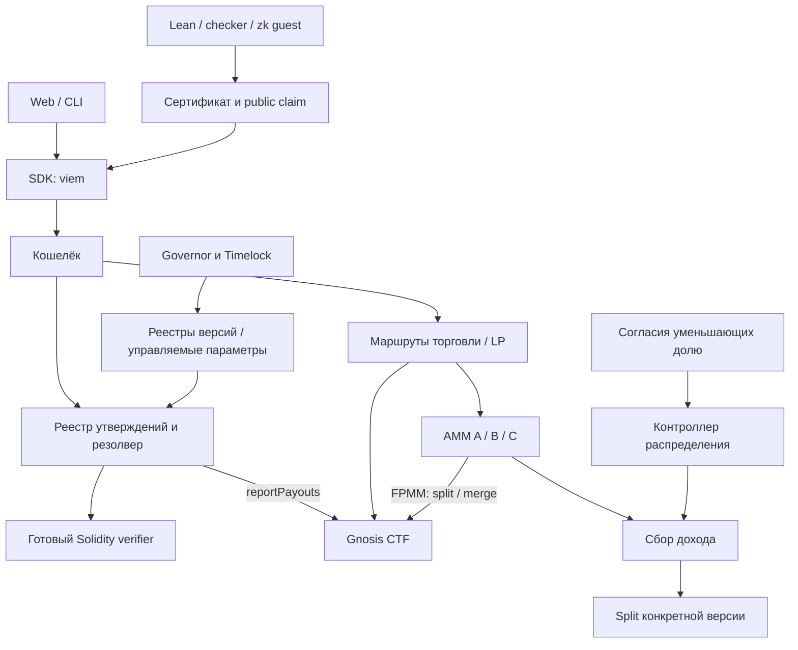

# Сборка протокола и контракты интеграции

Статус: подробная рекомендуемая спецификация, общая для [трёх вариантов](./architecture-options.md). Имена собственных контрактов и методы — проектный интерфейс, не готовый ABI. Существующие интерфейсы вызываем в закреплённой версии; примеры не заменяют исходный код зависимости.

## 1. Минимальный состав

| Модуль | Что хранит / делает | Готовое и собственное |
| --- | --- | --- |
| T | Балансы основного актива, согласованная эмиссия | OpenZeppelin ERC20; конфигурация эмиссии проекта |
| ProtocolRegistry | Версии профилей, backend, операторов; области разрешённого использования | Свой небольшой реестр, OZ access control/governance |
| StatementRegistry / ResolutionAdapter | Формальные идентификаторы, ссылки на артефакты, окончательный исход и время; роль oracle CTF | Своя специфика проекта; можно объединить в одном контракте |
| CTF | Обеспечение T, условные ERC-1155-позиции, split/merge/redeem | Неизменённый Gnosis Conditional Tokens |
| MarketFactory / adapters | Создание и регистрация официальных пулов; соответствие condition, активов, wrapper и fee recipient | Связка готовых factory и предметных частей Seer либо адаптация FPMM factory |
| AMM | Резервы, обмены и LP-права | Готовые FPMM/V2/Balancer с различиями A/B/C |
| AllocationController / FeeCollector | Предложения долей, обязательные согласия, активная версия и получение доходов | Свои правила согласия + готовые подписи/контроль доступа |
| Split версии | Делит поступившие активы и предоставляет получение выплат | Готовый Splits V2 PullSplit с неизменяемой конфигурацией версии |
| Governance | Предложения, голосование, очередь, исполнение | OpenZeppelin Governor/Timelock; субъект голосования пока выбирается |

Разделение логическое. Не создаём отдельный контракт для каждого поля, собственный ERC-1155, кошелёк, движок голосования или формулу AMM. CTF и старые AMM можно собирать отдельным toolchain и вызывать по ABI из Solidity 0.8.x: это взаимодействие контрактов, не наследование несовместимого исходника в одной компиляции.



## 2. Идентичность и публикация постановки

Предлагаемый `statementId` — хэш однозначного версионированного кодирования формальной спецификации. Используем структурное кодирование с явно заданными типами и domain separator; не конкатенацию произвольных строк. Дедупликация относится только к точному совпадению такой спецификации, а не к математической эквивалентности.

В Lean-профиле фиксируем:

```text
LeanSpec
  schemaVersion
  canonicalGoalCommitment    # выражение P, его контекст и зависимости
  challengeEnvironmentRoot  # базовое окружение и определения цели
  proofPolicyId              # checker-семантика, аксиомы, формат артефактов
```

Кодирование полей/хэшей выбирается в proof spike и закрепляется тестовыми векторами. Имя объявления — ссылка для tooling; совпадение одного имени недостаточно. Snapshot исходников, выбранное объявление, локальные зависимости, toolchain и воспроизводимый рецепт хранятся в адресуемом по содержимому манифесте. Будущий Solution в идентичность постановки не входит.

**Рекомендуемый путь регистрации без доказательства P:** tooling представляет цель определением вида `def marketGoal : Prop := P`, замыкая параметры явными кванторами. Проверяющая программа проверяет корректность P и окружения, не истинность P. Получается регистрационный сертификат с другим типом public claim, чем сертификат решения. Нельзя регистрировать «доказательство» за счёт объявления P произвольной аксиомой.

Для простого kernel-пути авторитетен `canonicalGoalCommitment`. Связь показанных исходников с ним воспроизводят независимые инструменты; её нельзя назвать доказанной zk без отдельного проверяемого elaboration. Если выбираем семантику «именно эти .lean-байты», регистрационный guest должен устанавливать соответствие исходников и экспорта, включая toolchain и импорты. Этот расширенный путь пока не подтверждён. [Исследование проверок](./research/proofs.md).

Метаданные — отдельная сущность: описание, теги и внешние ссылки могут иметь версии, но не меняют formal spec. В официальном каталоге показываем доступность пакета и статус проверки отображения. Для чтения/доказательства пакет должен скачиваться без обязательного аккаунта нашего сервиса. Рекомендуется хранение по хэшу с несколькими независимыми копиями и экспорт локального архива; один GitHub URL не гарантирует доступность зависимостей.

## 3. Проверяемый факт и CTF condition

Предлагаемый публичный результат guest:

```text
Claim
  claimSchemaVersion
  kind: GoalWellFormed | ProofAccepted
  statementId
  canonicalGoalCommitment
  challengeEnvironmentRoot
  proofPolicyId
  outcome: True | False      # только для ProofAccepted
```

Регистрация принимает только `GoalWellFormed`: guest проверяет `P : Prop` и корректность окружения, но этот сертификат никогда не даёт payout. Резолв принимает только `ProofAccepted`: guest дополнительно проверяет proof term именно P или ¬P. `kind` входит в аутентифицированный output и сверяется контрактом даже при одном program ID для обеих ветвей. Host не может просто подставить эти поля в успешный результат. Для False проверяется отрицание исходного P с фиксированной семантикой False/импликации. Allowlist имён аксиом не заменяет проверку полных объявлений аксиом и примитивов относительно доверенного базового окружения. Заголовок версии в пользовательском файле также не является подтверждением происхождения окружения.

`BackendRecord` связывает профиль с конкретными verifier, program/image ID или verification key, форматом результата и манифестом сборки. Контракт сверяет аутентифицированный public claim и зарегистрированную постановку. Хэш Git commit, хэш бинарника, program ID и codehash verifier фиксируются отдельно. Ончейн-запись не выполняет сборку из Git и сама не доказывает связь исходников с бинарником.

Математический факт может быть переносим между экземплярами протокола с той же канонической постановкой и политикой; это явное правило, а не право начислить награду повторно. Схемы наград за первое доказательство пока нет. Подписи согласий, транзакции и иные действия с полномочиями обязательно имеют собственную привязку к сети и экземпляру контракта.

Для одной версии бинарного условия:

```text
questionId = hash(statementId, resolutionPolicyVersion)
CTF.prepareCondition(resolutionAdapter, questionId, 2)  # один раз до split/funding
conditionId = CTF.getConditionId(resolutionAdapter, questionId, 2)
outcome order = [YES, NO]
index sets = [1, 2]; root parentCollectionId = 0
```

CTF position ID дополнительно зависит от collateral T и collection. CTF oracle — наш контракт, а не сервер или адрес автора. Все официальные пулы одного такого условия используют это соответствие. Переход в окончательное состояние и `reportPayouts(questionId, [1,0] либо [0,1])` выполняются атомарно: при ошибке любой части транзакция откатывается.

Повторная подача того же основания не создаёт второй payout. Иной исход после финализации отклоняется как переход состояния; отдельная диагностика конфликтующего валидного сертификата должна проверять его и давать наблюдаемый сигнал об инциденте. Уже погашенные CTF-активы вернуть сменой записи нельзя. Наличие двух принятых противоположных доказательств означает проблему политики/проверки, а не обычный пересмотр вероятности.

## 4. Операторы и время

Рекомендуемое представление — типизированные версии операций над уже зарегистрированными утверждениями. Lean используется для математических целей, небольшие обработчики — для событий протокола. Не пытаемся исполнять произвольный пользовательский код как доверенный оператор. Вариант «весь язык в Lean» сохраняется как иной выбор, но его связь со временем и историей цепочки тоже требует определения.

Минимальное проектное семейство:

| Выражение | True | False | Пока неизвестно |
| --- | --- | --- | --- |
| Lean(P) | Проверено P | Проверено ¬P | Нет принятого основания |
| ResolvedBy(S,d) | У S записан любой итог при `resolvedAt <= d` | Сейчас `timestamp > d`, своевременной записи нет | До конца срока записи нет |
| ResolvedAs(S,o) | Записан итог o | Записан противоположный итог | S не разрешено |
| ResolvedAsBy(S,o,d) | Итог o записан не позже d | Записан противоположный итог либо срок прошёл без своевременного o | Иное незавершённое состояние |

`ResolvedAs` трактуется как рынок будущего финального исхода, не как моментальный запрос «уже сейчас записано?». Граница срока включительная. Это предлагаемый ответ на ранее открытые вопросы; пользователь пока не утверждал точную семантику.

Для производного над производным рекомендуем буквальное время **записи резолва в цепочке**. Если первый производный можно было разрешить вчера, но `resolveDerived` вызвали сегодня, его `resolvedAt` — сегодня. Это позволяет не вводить вторую «логическую дату» и не переписывать историю. Интерфейс должен объяснять зависимость от вызова; автоматизация может вызывать открытый метод, но не меняет правило. Альтернатива effective-time сложнее и требует отдельной версии оператора.

При регистрации разрешаем ссылки только на существующие неизменяемые узлы. Вместе с запретом редактирования аргументов это исключает циклы. Фиксируем лимиты размера, числа аргументов и глубины; численные значения выбираем после gas-тестов. Обработчик вызывается без права изменять чужое состояние (например, через `staticcall`); выдаёт `Unresolved/True/False` по собственным аутентичным записям протокола. Резолвер сам фиксирует время и отправляет payout.

Нет неограниченного каскада обновления всех зависимых рынков. SDK/keeper подготавливает ограниченный список узлов в нужном порядке; `resolveMany` — опциональная пакетная операция. Один узел всегда можно завершить прямым вызовом. Стимулы keeper не нужны для корректности, но задержка и оплата газа влияют на доступность завершения.

## 5. Торговля и LP: что склеивает SDK

Вариант A передаёт T в FPMM; тот выполняет CTF split/merge. В B/C сначала используется ERC-20-обёртка конкретной CTF position. Wrapper должен иметь однозначную привязку `chain, CTF, collateral, condition, parentCollectionId, indexSet, metadataBytes`, выпускать токены только под переданные позиции и возвращать их при unwrap. Начальная схема использует `parentCollectionId=0`. У Gnosis metadata bytes влияют на адрес wrapper: один underlying допускает несколько ERC-20, поэтому официальная регистрация фиксирует один канонический адрес и metadata. Название YES не является идентичностью актива.

| Операция | A | B / C |
| --- | --- | --- |
| Создать пул | Зарегистрировать цель/condition, создать FPMM, внести T | Зарегистрировать цель/condition, найти/создать wrapper, создать AMM-пул, подготовить обе стороны взноса |
| Купить YES за T | buy с минимальным выходом | swap T → wrapped YES; отдельно показать отсутствие пула/ликвидности |
| Продать YES | sell с предельным расходом позиции / требуемым T | swap wrapped YES → T с минимумом T |
| Внести только T | Нативный addFunding | Дополнительный маршрут; split части T, вторая позиция возвращается или меняется с отдельным лимитом |
| Вывести LP | removeFunding возвращает исходы и комиссии | removeLiquidity/exit возвращает активы пула; при необходимости unwrap |
| Получить T после вывода | merge полных наборов; после резолва redeem победителя | Те же CTF-операции после unwrap плюс уже полученный T |

Ни у одного пути не обещаем «весь вывод всегда без потерь в T». Перед резолвом может остаться непарная позиция, для продажи которой нужна ликвидность. После резолва проигравший актив имеет нулевую выплату. Пример B без комиссий: из 100 T выпускаются 100 YES и 100 NO; для пары 100 YES / 50 T требуются ещё 50 T. Всего создатель использовал 150 T и сохранил 100 NO вне пула. Если он также создаёт пару 100 NO / 50 T, общий расход составляет 200 T. Полный расчёт зависит от желаемых резервов, а не от общего названия «100 T ликвидности».

Торговый router — удобный маршрут, а не источник обязательности комиссии. Комиссия официального пула должна исполняться в AMM/Vault. Проверяем caller/custody каждого переиспользованного маршрута: сохранённый в router баланс не должен становиться доступным следующему произвольному вызывающему, остатки возвращаются заданному владельцу. Slippage, срок действия котировки и получатель относятся к исполняемым лимитам. Если старый AMM не предоставляет нужный лимит, это задача конкретного адаптера/изменения, а не только проверка в JS.

Позиции после резолва получают право на погашение, не меняются автоматически в кошельке на ERC-20 T. CTF `redeemPositions` погашает доступные балансы выбранных наборов по своему ABI; абстрактное `redeem(amount)` не переносим на него без учёта этого поведения. Batch/atomic-маршрут возможен только если конкретные вызовы и approvals это позволяют; иначе UI показывает возобновляемые этапы.

## 6. Комиссии и согласия

База распределения — выделенный протокольный/creator доход после правил AMM, не все торговые комиссии вместе с долей LP. Размер этого дохода и проценты таблицы — разные параметры.

`AllocationProposal` включает текущую версию, полную канонически упорядоченную новую таблицу, срок действия при его наличии и domain сети/контракта. Доли — целые числа единого знаменателя; сумма равна знаменателю, дубликаты и недопустимые адреса отвергаются. Уменьшение проверяем по объединению старого и нового набора адресов; удаление означает ноль.

Контроллер хранит согласия именно теряющих долю адресов. Нужны все такие согласия, а не кворум. Начальная рекомендация — прямые onchain approve/revoke от адреса. EIP-712 с проверкой EOA/ERC-1271 через готовый примитив можно добавить для пакетного применения; такие подписи проверяются на момент execute, поскольку ERC-1271 validation может измениться. Сохранённое onchain-согласие от Safe не отзывается автоматически при смене его owners: для него действует явный revoke. После смены текущей версии старое предложение не может примениться. Технически ограничиваем размер одной таблицы, чтобы применение всегда укладывалось в транзакцию; значение определяется тестом и ожидаемым числом участников.

После применения новая версия указывает на новый Split с `owner=address(0)` и неизменяемыми долями. Начальная рекомендация — `distributionIncentive=0`, чтобы дополнительный keeper fee не менял базу процентов. Ранее поступившие в старый Split активы и уже назначенные выплаты сохраняются за старой таблицей. Ни controller, ни общее governance не получают обходного права `updateSplit/execCalls` на этот Split. Остатки округления остаются в своей версии и учитываются по правилам зависимости, не переносятся молча к новым адресам.

**Вариант учёта, требующий согласования:** доля действует на средства при распределении из collector в конкретный Split. Это однозначный ончейн-момент с событием; до него UI показывает «ещё не распределено», не «уже начислено вам». В A можно делать такой перевод непосредственно при сделке. В B/C старый доход может ещё находиться в AMM либо collector, поэтому после смены таблицы он попадёт в новую версию, если отдельно не выполнить корректный cutover. Нельзя называть такую модель учётом по времени сделки.

Если нужно сохранять доли от момента каждой сделки, до переключения требуется checkpoint всех затронутых источников или исторический учёт по каждому пулу. Permissionless число пулов не позволяет предполагать один неограниченный цикл обхода. Такое требование усиливает аргумент в пользу A либо отдельного более сложного fee-accounting слоя; готовые Splits сами его не решают. В B допустима выплата LP-токена в натуре: его будущий состав/стоимость меняются, а pending ещё не выпущенный protocol LP не является балансом старого Split.

## 7. Обновления и полномочия

Рекомендуемые категории изменений:

| Изменение | Исполнитель | Действие на существующие обязательства |
| --- | --- | --- |
| Новый оператор / профиль / backend | Governance после проверки релиза | Новая запись с новой версией; старые цели не переписываются |
| Запрет нового использования версии | Governance | Запрещает новые регистрации; не обязан запрещать доказательства старых целей |
| Отключение скомпрометированного verifier | Явно согласованный emergency-процесс | Может остановить новые резолвы; не отменяет уже исполненный payout |
| Добавление совместимого backend старому профилю | По заранее определённой политике | Только при подтверждённо той же семантике; это чувствительное право |
| Изменение долей | Любой инициатор + согласия всех теряющих + любой исполнитель | Новая версия распределения, прежние назначенные выплаты сохраняются |
| Новый AMM / CTF / релиз приложения | Governance для официального каталога; развёртывание новой версии | Старые неизменяемые контракты продолжают существовать; миграция требует явного маршрута |

Рекомендуем ограничить emergency приостановкой новых регистраций/резолвов, сохраняя уже доступное погашение и вывод из готовых неизменяемых компонентов. Это не скрытый администратор математического исхода: метода «назначить True по голосованию» в предложенной модели нет. Если пользователь хочет такой предел изменить, это другое основание доверия и должно быть видно до входа в рынок.

Неизменяемая таблица защищает конкретные средства и правила её изменения. Она не может запретить выпуск другой версии проекта или отвлечение будущих fee flows контрактом, который governance вправе заменить. Область защищённого fee-routing нужно выбрать вместе с полномочиями обновления, а не заявлять абсолютную защиту одних процентов.

## 8. Приложение, данные и контракты ошибок

SDK возвращает описание операции и проверяемые параметры, а signer подключает вызывающее приложение. Для read API указываем блок/сеть и отставание индекса. Для write API различаем подготовку, approvals, подпись, отправку, включение, подтверждение, отказ и revert. После reorg индекс и UI возвращают корректный незавершённый статус; повторная отправка не должна создавать дубли офчейн-задания.

Proof job хранит job ID, владельца сессии, входной manifest hash, профиль, версию runner, состояние, диагностику и хэши результата. Worker принимает ограниченный формат задания, работает изолированно без ключей кошелька, блокчейн-admin секретов и доступа к данным других jobs. Состояния LeanAccepted, ProofReady и Resolved не объединяем. Локальный CLI экспортирует тот же результат; удалённый worker не имеет права назначать payout.

Комментирование: SIWE-сессия устанавливает адрес автора; PostgreSQL хранит текст/редакции и привязку к statementId. Предлагаемый простой режим — публичное чтение, адресные записи, авторские редакции с историей, модерация видимости с причиной; цепочка и доказательства от модерации не зависят. Частные обсуждения, социальная репутация и переносимый подписанный social graph не требуются исходным заданием.

Palomar — дополнительный источник материалов с точной версией записи/snapshot. Поиск может быть недоступен без остановки создания и резолва собственных задач. Импорт успешного доказанного результата может немедленно привести к резолву: регистрация в Palomar не создаёт искусственной неопределённости.

Проектные категории ошибок: UnsupportedProfile, GoalMismatch, EnvironmentMismatch, InvalidCertificate, AlreadyResolved, NotResolvableYet, UnknownDependency, StaleAllocationVersion, MissingConsent, SlippageExceeded, WrongNetwork, ArtifactUnavailable. Готовые контракты имеют свои revert-форматы; SDK нормализует их, сохраняя исходные данные для диагностики. Ошибка стороннего RPC и отклонение доказательства — разные результаты.

События собственных контрактов должны позволять восстановить statement/condition/pool mapping, версии профилей и allocation, исход/время/хэш evidence, предложения/согласия и направления fee transfers. Полные большие пакеты и комментарии не дублируем в events. ABI событий, хэширование и schema version фиксируем до написания индексатора.

## 9. Граница готовности этой спецификации

Определены ответственности, потоки активов, важные права и несовместимости готовых частей. Не выполнены развёртывание, сборка всех зависимостей, zk benchmark и аудит интеграции. Точные ABI, bytecode, лимиты, адреса, ставки и production-конфигурации закрепляются после проверок из [плана реализации](./delivery-plan.md). Исследовательский commit — воспроизводимая ссылка на рассмотренный код, а не автоматически выбранный production-релиз.
